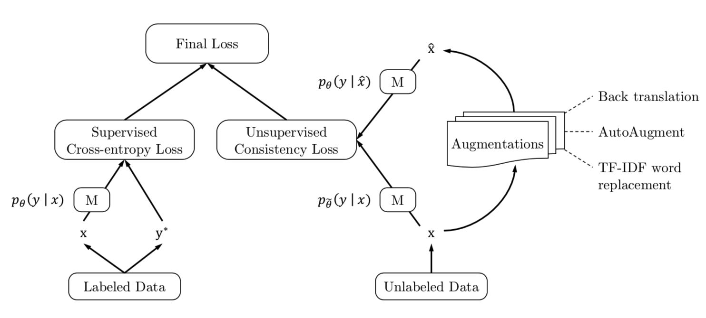

# UDA(Unsupervised Data Augmentation) with BERT
This is re-implementation of Google's UDA [[paper]](https://arxiv.org/abs/1904.12848)[[tensorflow]](https://github.com/google-research/uda) in pytorch through with Kakao Brain's Pytorchic BERT[[pytorch]](https://github.com/dhlee347/pytorchic-bert).

Model  | UDA official | This repository
-- | -- | --
UDA (X) | 68% |  
UDA (O) | 90% | 88.45%

## UDA
> UDA(Unsupervised Data Augmentation) is a semi-supervised learning method which achieves SOTA results on a wide variety of language and vision tasks. With only 20 labeled examples, UDA outperforms the previous SOTA on IMDb trained on 25,000 labeled examples. (BERT=4.51, UDA=4.20, error rate)

> * Unsupervised Data Augmentation for Consistency Training (2019 Google Brain, Q Xie et al.)

#### - UDA with BERT
UDA works as part of BERT. It means that UDA act as an assistant of BERT. So, in the picture above model **M** is BERT.

#### - Loss
UDA consist of supervised loss and unsupervised loss. Supervised loss is traditional Cross-entropy loss and Unsupervised loss is KL-divergence loss of original example and augmented example outputs. In this project, I used Back translation technique for augmentation. 
The supervised loss and unsupervised loss are added to form a total loss and then total loss is descent. To be careful is loss doesn't descent trough original example route. Only by labeled data and augmented unlabeled data Model's weights are updated.

#### - TSA(Training Signal Annealing)
There is a large gap between the amount of unlabeled data and that of labeled data. So, it is easy to overfit to labeled data. Therefore, TSA technique mask out the examples that predicted probability is bigger than threshold. The threshold is scheduled by log, linear or exponential function. 
    
    

#### - Sharpening Predictions
The KL-divergence loss(ori, aug) is too small to just use. It can cause that the total loss is dominated by supervised loss. Therefore, Sharpening Prediction techniques is needed.

- Confidence-based masking : Maksing out examples that the current model is not confident about. Specifically, in each minibatch, the consistency loss term is computed only on examples whose highest probability.
- Softmax temperature controlling : Be used when computing the predictions on original example. Specifically, probability of original example is computed as Softmax(l(x)/τ) where l(x) denotes the logits and τ is the temperature. A lower temperature corresponds to a sharper distribution.  (UDA, 2019 Google Brain, Q Xie et al.)

## Requirements
**UDA** : python > 3.6, fire, tqdm, tensorboardX, tensorflow, pytorch, pandas, numpy

## Overview

- [`download.sh`](./download.sh) : Download pre-trained BERT model from Google's official BERT and IMDb data file
- [`load_data.py`](./load_data.py) : Load the data of sup, unsup
- [`models.py`](./models.py) : Model calsses for a general transformer (from Pytorchic BERT's code)
- [`main.py`](./main.py) : Including default BERT, UDA(TSA, Sharpening) modes
- [`train.py`](./train.py) : A custom training class(Trainer class) adopted from Pytorhchic BERT's code
- ***utils***
  - [`configuration.py`](./utils/configuration.py) : Set a configuration from json file
  - [`checkpoint.py`](./utils/checkpoint.py) : Functions to load a model from tensorflow's file (from Pytorchic BERT's code)
  - [`optim.py`](./utils.optim.py) : Optimizer (BERTAdam class) (from Pytorchic BERT's code)
  - [`tokenization.py`](./utils/tokenization.py) : Tokenizers adopted from the original Google BERT's code
  - [`utils.py`](./utils/utils.py) : A custom utility functions adopted from Pytorchic BERT's code

## Pre-works

#### - Download pre-trained BERT model
First, you have to download pre-trained BERT_base from Google's BERT repository.

    bash download_BERT_Base_Uncased.sh
After running, you can get the pre-trained BERT_base_Uncased model at **/BERT_Base_Uncased** directory.

#### - Data
I use already pre-processed and augmented IMDb data extract from official [UDA](https://github.com/google-research/uda). If you want to use your raw data, change need_prepro = True.

## Example usage
This project are broadly divided into two parts(Fine-tuning, Evaluation). 
**Caution** : **Before runing code, you have to check and edit config file**

1. **Fine-tuning**
 You can choose train mode(train, train_eval) on non-uda.json or uda.json (default : train_eval).
    - Non UDA fine-tuning

            python main.py \
                --cfg='config/non-uda.json' \
                --model_cfg='config/bert_muling.json'

    - UDA fine-tuning

            python main.py \
                --cfg='config/uda.json' \
                --model_cfg='config/bert_muling.json'

2. **Evaluation**
- Basically evaluation code, dump out results file. So, you can change dump option in [main.py](./main.py) There is two mode (real_time print, make tsv file)

        python main.py \
            --cfg='config/eval.json' \
            --model_cfg='config/bert_muling.json'

## Acknowledgement
Thanks to references of [UDA](https://github.com/google-research/uda) and [Pytorchic BERT](https://github.com/dhlee347/pytorchic-bert), I can implement this code.

## TODO
It is known that further training(more pre-training by the specific corpus on already pre-trained BERT) can improve performance. But, this repository does not have pretrain code. So, pretrain code will be added. If you want to further training you can use [Pytorchic BERT](https://github.com/dhlee347/pytorchic-bert) 's pretrain.py or any BERT project.
